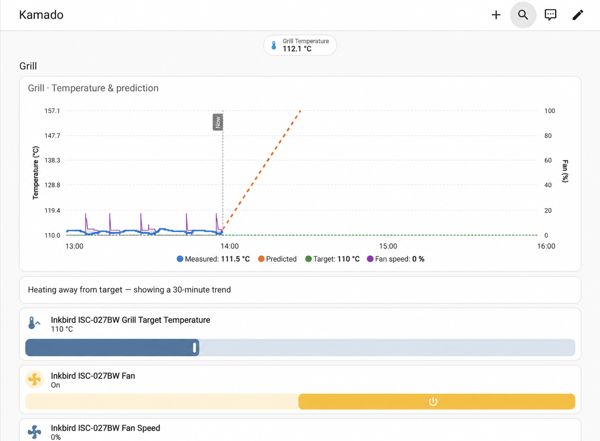
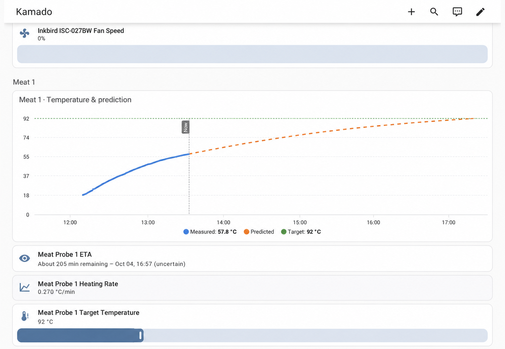
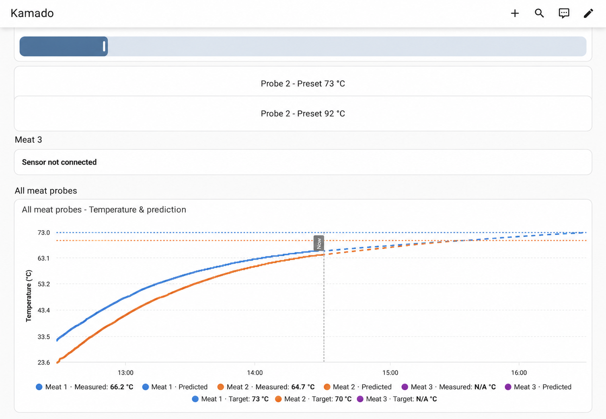

# Inkbird ISC-027BW Home Assistant Kit

An unofficial, fully local Home Assistant setup for the Inkbird ISC-027BW
Bluetooth grill controller. It combines a corrected custom integration with a
predictive Kamado dashboard and reusable iPhone alarms.

## Dashboard preview

### Grill temperature, prediction and fan activity



### Individual meat-probe ETA



### Combined meat-probe predictions and targets



## What is included

- Four live temperature channels and fan data over BLE.
- Writable grill and probe target temperatures.
- Confirmed probe-target writes with retries, preventing the UI from briefly
  accepting a preset and then jumping back to the old value.
- Proper `unavailable` states while disconnected, preventing false zeroes in
  temperature history.
- A responsive dashboard with grill, fan and three meat-probe sections.
- One-minute grill trend prediction and 20-minute meat-probe trend smoothing.
- Newton's-law-style meat ETA curves, target lines and preset buttons.
- Dynamic probe sections that show `Sensor not connected` when unplugged.
- An iOS critical-notification blueprint that repeats every minute until the
  user taps **Acknowledge**.

## Requirements

- Home Assistant 2026.1 or newer.
- Bluetooth access to the ISC-027BW, directly or through an ESPHome Bluetooth
  proxy. Put the proxy near the controller for a stable active BLE connection.
- [ApexCharts Card](https://github.com/RomRider/apexcharts-card) installed from
  HACS for the predictive charts.
- The Home Assistant Companion app for critical iPhone notifications.

## Installation

### 1. Install the integration

#### HACS custom repository

1. Open **HACS → Integrations → ⋮ → Custom repositories**.
2. Add `https://github.com/GligaPeter/inkbird-isc027bw-home-assistant` as an
   **Integration** repository.
3. Search for **Inkbird ISC-027BW BLE**, download it and restart Home Assistant.

#### Manual installation

1. Copy `custom_components/inkbird_ble` into the `custom_components` directory
   under your Home Assistant configuration directory.
2. Restart Home Assistant.
3. Open **Settings → Devices & services → Add integration**.
4. Search for **Inkbird ISC-027BW BLE** and enter the controller's BLE address.

Do not keep the Inkbird mobile app connected while Home Assistant is using the
controller. The controller accepts a limited number of active BLE connections.

### 2. Add the prediction helpers

1. Ensure packages are enabled in `configuration.yaml`:

   ```yaml
   homeassistant:
     packages: !include_dir_named packages
   ```

2. Copy `packages/inkbird_prediction.yaml` to your Home Assistant `packages`
   directory.
3. Check the entity IDs against [the mapping](docs/ENTITY_IDS.md). Adjust both
   YAML files if Home Assistant appended a suffix such as `_2`.
4. Restart Home Assistant. The derivative sensors need several readings before
   they can produce a stable prediction.

### 3. Add the dashboard

1. Install **ApexCharts Card** from HACS and refresh the browser.
2. Create a new dashboard in Home Assistant.
3. Open the dashboard menu, choose **Raw configuration editor**, and paste the
   contents of `dashboard/kamado-dashboard.yaml`.

The grill chart uses the last minute for its trend. Stable and rising grill
temperatures show five minutes of prediction; cooling may show up to 30
minutes. Meat probes use a 20-minute derivative and an exponential heating
model toward the chamber temperature.

### 4. Create repeating phone alarms

1. Copy
   `blueprints/automation/inkbird_isc027bw/repeating_probe_alarm.yaml` to the
   same path below your Home Assistant `blueprints/automation` directory.
2. Reload automations or restart Home Assistant.
3. Create one automation from the blueprint for each connected meat probe.
4. For each automation choose the probe sensor, its matching Alarm Temperature
   number entity, and your phone's notify action, for example
   `notify.mobile_app_my_iphone`.
5. On the iPhone, allow **Critical Alerts** for the Home Assistant app.

The automation starts whenever a reading changes from below the target to equal
to or above it. A jump such as 72 → 74 °C still triggers a 73 °C target. The
notification repeats every minute until **Acknowledge** is tapped.

## Updating an existing upstream installation

This repository retains the same `inkbird_ble` domain as the original
integration. Back up your Home Assistant configuration, replace the integration
directory, restart Home Assistant, and verify the existing entity IDs before
adding the dashboard package.

## Limitations

- Only the ISC-027BW has been tested.
- The dashboard assumes Celsius.
- Predictions are estimates. Opening the lid, moving a probe, wrapping meat or
  changing airflow invalidates the recent trend until enough new data arrives.
- Home Assistant cannot detect a target crossing that happens entirely during
  an interval in which no temperature data is received.
- The controller exposes alarm target temperatures, but the integration has no
  confirmed BLE field for the controller's own audible-alarm state. Phone
  alarms therefore compare each measured temperature with its target in Home
  Assistant.

## Credits and license

The integration is based on
[777Timo/inkbird-ble-ha](https://github.com/777Timo/inkbird-ble-ha) by Timo
Prager. See [NOTICE.md](NOTICE.md) for the additions in this kit. The original
MIT License is preserved in [LICENSE](LICENSE).

This project is unofficial and is not affiliated with Inkbird.
